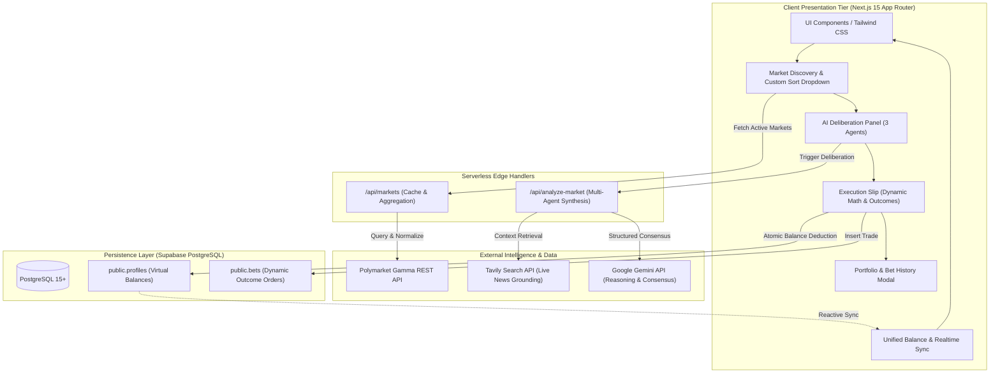
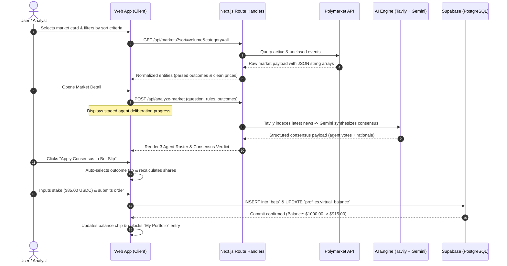

# 🌐 Polymarket AI Predictor & Paper Trading Terminal

> Institutional-grade prediction market terminal combining decentralized probability data, real-time multi-agent AI consensus, and zero-risk paper trading execution. Built with Next.js 15, TypeScript, Supabase, and Tailwind CSS.

[](https://www.typescriptlang.org/)
[](https://nextjs.org/)
[](https://supabase.com/)
[](https://vitest.dev/)
[](https://tailwindcss.com/)

---

## ⚡ Executive Summary

Prediction markets reflect real-world probabilities through financial consensus, but retail traders often encounter two major barriers:

1. **Information Asymmetry:** Breaking developments outpace manual research, leaving users at a disadvantage against automated participants.
2. **Capital Risk on Incomplete Data:** Testing thesis execution requires real money, raising the barrier to entry.

**Polymarket AI Predictor** solves both problems. It continuously pulls live event order-book data from Polymarket's Gamma API, passes contextual market rules through a **3-Agent AI Deliberation Committee** (powered by Tavily Search and Google Gemini), and allows users to simulate positions in a dedicated **Paper Trading Execution Slip** with persistent virtual balances and portfolio tracking.

---

## 🏛️ System Architecture



---

## 🔄 End-to-End Execution Sequence



---

## 🔬 Core Engineering Highlights

### 1. Multi-Agent AI Deliberation Committee
Instead of a generic single-prompt chat interaction, analysis is decoupled across three specialized autonomous perspectives:
- **Resolution Auditor (`ShieldCheck`):** Scrutinizes the contract's official resolution rules to flag ambiguity, settlement conditions, and edge-case dispute traps.
- **Sentiment & News Hunter (`Newspaper`):** Calls Tavily API to extract clean, un-hallucinated facts from real-time news sources published in the last 24 hours.
- **Risk & Value Arbiter (`TrendingUp`):** Weighs implied market odds against empirical likelihood to detect positive expected value (+EV) and margin of safety.
- **Interactive Handoff:** Includes a high-contrast **"Apply Consensus to Bet Slip"** action that bridges the committee's findings directly into the trading form.

### 2. Resilient Polymarket Data Normalization
Polymarket's Gamma API delivers polymorphic data structures: outcomes and outcomePrices often arrive as stringified JSON arrays (e.g. `'["Yes", "No"]'`) or custom multi-choice options (`'["Over 2.5", "Under 2.5"]'`).
- **Defensive Parsing:** An edge sanitization utility parses nested stringified payloads with fallback guarantees.
- **Dynamic Contract Adaptation:** Completely moves away from binary assumptions. Labels, order slip tabs, and database records adapt dynamically to the market's real outcome terms.
- **Semantic Palette Assignment:** Programmatically assigns affirmative/first-position choices to emerald tokens and opposing/secondary choices to rose tokens.

### 3. Unified Balance State & Portfolio Ledger
- **Atomic Balance Management:** Synchronized state across navigation indicators, slip validation, and Supabase ledger entries.
- **Dynamic Database Constraints:** Removed restrictive legacy `CHECK (outcome IN ('YES', 'NO'))` constraints in PostgreSQL to store full dynamic outcome labels safely.
- **My Portfolio Modal:** Real-time ledger view allowing traders to track position sizes, entry prices, potential returns, and historical timestamps.

### 4. Apple-Grade Human Interface Engineering
- **Desktop vs. Mobile Viewport Isolation:** Two-column sticky split on desktop transitions into an accessible slide-over drawer on mobile, utilizing guarded `document.body.style.overflow` locking that never hijacks desktop scroll behavior.
- **Custom Sort Popover:** Replaced default browser select tags with an accessible, keyboard-navigable popover dropdown supporting **Volume**, **Ending Soon** (filtering out expired events), and **Newest**.
- **Floating Quick-Actions:** A throttled, smooth-scrolling "Back to Top" pill docked cleanly inside the content column.

---

## 🛠️ Architecture & Engineering Trade-offs

| Decision Point | Choice Made | Alternative Considered | Engineering Rationale |
| :--- | :--- | :--- | :--- |
| **Data Fetching Layer** | Next.js Server Handlers (`/api/*`) | Client-side direct fetching | Hides sensitive API tokens (Tavily/Gemini), enables server-side response caching, and prevents CORS and payload bloat on mobile clients. |
| **Testing Framework** | Vitest + React Testing Library | Jest | Native ESM and TypeScript support with shared Vite configuration, achieving sub-second test runs without complex Babel transpilation. |
| **AI Context Ingestion** | Tavily API | Direct Google Search / Web Scraping | Bypasses anti-bot barriers, cookie consent walls, and token-heavy HTML noise by extracting clean markdown content directly for LLM consumption. |
| **Outcome Model** | Dynamic String Arrays | Binary Boolean Flags (`isYes`) | Supports real-world categorical markets (e.g., elections, over/under spreads) without breaking data contracts or database constraints. |
| **State Persistence** | Supabase Postgres + Realtime | LocalStorage / In-Memory State | Provides true cross-device session persistence, transactional balance integrity, and audit-ready paper trading records. |

---

## 🧪 Comprehensive Test Suite

The test suite is built on **Vitest** and **React Testing Library**, prioritizing numerical precision, data resilience, and defensive UI states:

```bash
# Run test suite
npm run test

# Run tests in watch mode
npm run test:watch
```

### Tested Modules
- **[`tests/unit/betMath.test.ts`](tests/unit/betMath.test.ts):** Validates share derivation ($Amount / Price), $1.00 USDC terminal payout resolutions, percentage ROI calculations, and edge cases (zero/negative amounts, pricing boundaries).
- **[`tests/unit/polymarketNormalize.test.ts`](tests/unit/polymarketNormalize.test.ts):** Verifies JSON-stringified outcome parsing, corrupt payload fallbacks, and multi-condition market sorting (`ending_soon` temporal filtering).
- **[`tests/components/BetSlip.test.tsx`](tests/components/BetSlip.test.tsx):** Asserts reactive outcome badge styling, dynamic label injections, and balance-defensive disabled states.

---

## 🗄️ Database Schema (Supabase PostgreSQL)

```sql
-- Profiles table for user balances
create table public.profiles (
  id uuid primary key references auth.users(id) on delete cascade,
  username text default 'Demo Trader',
  virtual_balance numeric(12, 2) default 1000.00 not null,
  created_at timestamp with time zone default timezone('utc'::text, now()) not null
);

-- Bets table supporting dynamic multi-outcome positions
create table public.bets (
  id uuid primary key default gen_random_uuid(),
  profile_id uuid references public.profiles(id) on delete cascade,
  market_id text not null,
  market_question text not null,
  outcome text not null,
  amount numeric(10, 2) not null check (amount > 0),
  price numeric(4, 2) not null check (price > 0 and price <= 1.00),
  shares numeric(12, 2) not null check (shares > 0),
  potential_payout numeric(12, 2) not null,
  status text default 'OPEN' check (status in ('OPEN', 'WON', 'LOST', 'REFUNDED')),
  created_at timestamp with time zone default timezone('utc'::text, now()) not null,
  constraint bets_outcome_check check (length(trim(outcome)) > 0)
);

-- Row Level Security (RLS)
alter table public.profiles enable row level security;
alter table public.bets enable row level security;

create policy "Public read profiles" on public.profiles for select using (true);
create policy "Users update own balance" on public.profiles for update using (true);
create policy "Public read bets" on public.bets for select using (true);
create policy "Public insert bets" on public.bets for insert with check (true);
```

---

## 🚀 Getting Started

### 1. Clone & Install Dependencies
```bash
git clone https://github.com/your-username/polymarket-ai-widget.git
cd polymarket-ai-widget
npm install
```

### 2. Environment Variables Setup
Create `.env.local` in the project root:
```env
# Supabase Configuration
NEXT_PUBLIC_SUPABASE_URL=https://your-supabase-project.supabase.co
NEXT_PUBLIC_SUPABASE_ANON_KEY=your-supabase-anon-key

# Single Source of Truth Demo Profile (Optional override)
NEXT_PUBLIC_DEMO_USER_ID=f07d5b04-96ab-4fd7-97ad-fc1056644be1

# AI Intelligence & Retrieval
GEMINI_API_KEY=your-google-gemini-api-key
TAVILY_API_KEY=your-tavily-api-key

# Public Polymarket Endpoints
NEXT_PUBLIC_POLYMARKET_API_URL=https://gamma-api.polymarket.com
```

### 3. Build & Verify
```bash
# Verify type integrity and production build
npm run build

# Run unit tests
npm run test

# Launch development server
npm run dev
```

Navigate to [http://localhost:3000](http://localhost:3000) to interact with the terminal.
