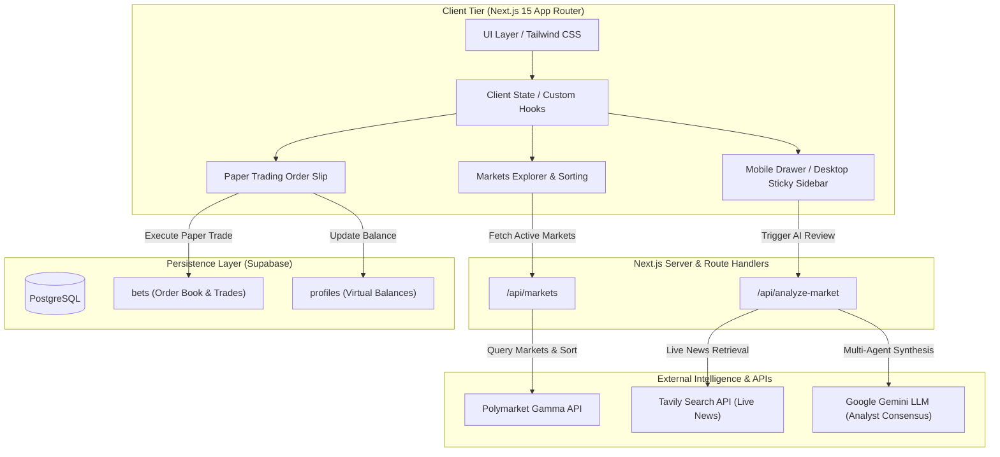
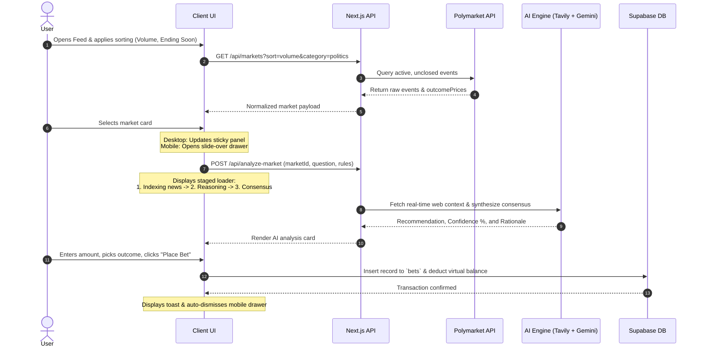
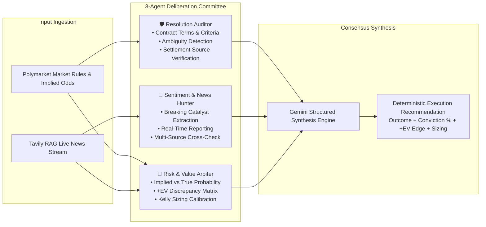

# 🌐 Polymarket AI Predictor & Paper Trading Terminal

> An institutional-grade, Apple-inspired prediction market terminal that bridges decentralized probability feeds with real-time multi-agent AI reasoning and risk-free paper trading execution.

---

## ⚡ Executive Summary (For Stakeholders & Product Leaders)

Prediction markets like Polymarket aggregate real-world probabilities through collective capital, yet retail participants face two structural hurdles:

1. **Information Asymmetry:** Breaking events evolve faster than single retail traders can research and price.
2. **Execution Friction:** Real capital exposure prevents users from validating strategies or building conviction before trading.

**Polymarket AI Predictor** solves this by pairing Polymarket's live Gamma market feeds with a **Multi-Agent AI Consensus Engine** and a **zero-risk Paper Trading Engine**. Users can explore high-volume global markets, monitor simulated multi-step AI due diligence, identify probability edges, and simulate positions with virtual USDC—all inside an interface built around Apple-grade design standards.

---

## 🏛️ System Architecture



---

## 🔄 End-to-End Decision Flow



---

## 🧠 Multi-Agent AI Deliberation Engine: How Agents Work & Decide

Rather than relying on a single monolithic LLM prompt that suffers from bias, hallucinations, and uncalibrated probabilities, the terminal employs a **modular 3-Agent Deliberation Architecture**. This simulates an institutional investment committee where specialized AI personas independently examine the market across orthogonal analytical dimensions before synthesizing a unified consensus:



### 1. Committee Personas & Division of Labor

| Agent Persona | Focus Domain | Primary Sources & Heuristics | Decision Output |
| :--- | :--- | :--- | :--- |
| **🛡️ Resolution Auditor** | Rules, Settlement Criteria & Contract Integrity | Polymarket contract terms, resolution sources (AP, BLS, SEC, government gazettes), expiration timestamps, and conditional clauses. | Validates resolution viability, assesses settlement dispute risk, and votes on outcome conformity with strict contractual criteria. |
| **📰 Sentiment & News Hunter** | Live Ground Truth & External Signals | Tavily Search API (real-time news indexing, journalistic articles, breaking wires, press releases, and polling datasets). | Identifies catalysts, filters noise from factual developments, cross-references source reliability, and extracts real-time sentiment direction. |
| **📐 Risk & Value Arbiter** | Mathematical Edge & Portfolio Sizing | Order book pricing ($P_{\text{market}}$), implied probability distribution, Fractional Kelly Criterion, and asymmetric risk/reward. | Calculates expected value ($+EV$), identifies pricing dislocations between market odds and committee conviction, and computes optimal position size. |

---

### 2. The 5-Phase Deliberation & Decision Pipeline

```
[Phase 1: Ingestion] ──▶ [Phase 2: RAG Retrieval] ──▶ [Phase 3: Agent Scrutiny] ──▶ [Phase 4: Consensus] ──▶ [Phase 5: Slip Routing]
```

1. **Phase 1: Contract Ingestion & Parameter Normalization**
   - When a market is selected, the application ingests the market payload from Polymarket's Gamma API.
   - Extracts the core question, detailed description/rules, resolution timestamp (`endDate`), outcome token identifiers (`clobTokenIds`), and live trading prices.
   - Dynamically parses outcome identifiers (e.g., `["Yes", "No"]`, `["Over 2.5", "Under 2.5"]`, or candidate names) to eliminate binary assumptions.

2. **Phase 2: Live News Retrieval (Tavily RAG)**
   - The route handler `/api/analyze-market` queries the Tavily API using high-authority news filtering.
   - Extracts validated article snippets, publication timestamps, and source URLs.
   - This grounds the AI in up-to-the-minute real-world events, ensuring recommendations reflect developments that occurred minutes prior rather than static pre-training weights.

3. **Phase 3: Multi-Perspective Agent Deliberation**
   - **Resolution Auditor:** Interrogates whether the condition is objectively verifiable. For example, in a geopolitical market: *"Does the contract require official treaty ratification or merely a signed ceasefire declaration?"* Ambiguity triggers a confidence penalty.
   - **News Hunter:** Analyzes real-time reporting for confirmed milestones. Disregards partisan editorializing, extracts verifiable consensus facts, and weights corroborating reports.
   - **Value Arbiter:** Formulates an unconstrained probability distribution $P_{\text{true}}$ and compares it directly with market pricing.

4. **Phase 4: Structured Consensus Synthesis (Gemini Engine)**
   - Google Gemini receives a multi-agent system prompt combining contract specifications and indexed news context.
   - Enforces a deterministic JSON Schema via Gemini's Structured Outputs (`Type.OBJECT`):
     ```typescript
     interface AIRecommendation {
       recommendedOutcome: 'YES' | 'NO';
       confidence: number;         // 0 - 100 percentage
       rationale: string;          // 2-3 sentence executive synthesis
       recommendedBetSize: number; // 1 - 100 USDC (Kelly-proportional)
     }
     ```
   - The model acts as the Committee Chair, reconciling differing views into a unified consensus recommendation.

5. **Phase 5: Execution Sizing & One-Click Routing**
   - The client renders the verdict card, detailing the individual agent votes, source counts, and calculated $+EV$ edge.
   - Clicking **"Apply Consensus to Bet Slip"** injects the recommended outcome and position size directly into the order form and smoothly focuses the execution input.

---

### 3. Mathematical Edge Formulation & Position Sizing

The Committee does not simply predict *"Who will win?"*—it identifies **pricing inefficiencies** ($+EV$ opportunities).

#### A. Market Implied Probability vs. Committee Conviction
Given the contract price for outcome $i$, the market's implied probability is:
$P_{\text{implied}} = \text{Price}_i \times 100\%$

If the consensus conviction $P_{\text{conviction}} > P_{\text{implied}}$, a positive expected value edge exists:
$\text{EV Edge (\%)} = P_{\text{conviction}} - P_{\text{implied}}$

*Example:* If YES trades at **42¢** ($P_{\text{implied}} = 42\%$) but the Committee calculates a **60% conviction** based on breaking polling data, the market is mispricing the asset by **+18% EV Edge**.

#### B. Fractional Kelly Criterion for Position Sizing
To prevent portfolio ruin while compounding capital, the Value Arbiter applies a conservative **Fractional Kelly** sizing heuristic:
$f^* = \frac{b \cdot p - q}{b}$
Where:
- $p = \text{Assessed probability of winning}$
- $q = 1 - p$
- $b = \text{Net odds received} = \frac{1 - \text{Price}}{\text{Price}}$

The system normalizes this fractional stake into a calibrated allocation between **\$1.00 and \$100.00 USDC**, scaling conservatively when conviction is marginal and aggressively when high-conviction dislocations are discovered.

---

### 4. Anti-Hallucination & Determinism Guardrails

- **Zero-Unchecked-Knowledge Policy:** If breaking news is unavailable, the system explicitly acknowledges missing external context and bases its confidence strictly on base rates and contract ambiguity risks.
- **Strict JSON Schema Enforcement:** Gemini generation uses `responseMimeType: 'application/json'` with an enforced typed schema, preventing markdown formatting drift, conversational filler, or parsing crashes.
- **Dynamic Outcome Alignment:** Outcomes are mapped programmatically back to the market's specific contract outcome array, preventing YES/NO inversion on negatively framed questions (e.g., *"Will X fail to happen?"*).
- **Client-Side Cache Layer:** Deliberation results are indexed client-side by `market.id` to prevent redundant LLM invocations and guarantee instant re-renders when navigating between markets.

---

## 🚀 Key Features

### 1. Market Feed & Dynamic Normalization
- **Full Polymarket Ingestion:** Direct integration with Polymarket’s Gamma API with server-side normalization for variable payloads.
- **Dynamic Outcome Parsing:** Automatically handles binary (YES/NO), categorical (Candidate A/Candidate B), and metric-driven markets (Over/Under) directly from outcomes arrays.
- **Multi-Vector Sorting:** Instant sorting across Highest Volume, Ending Soon (filtering strictly non-expired timestamps), and Newest Markets.
- **Category Overflow Navigation:** Horizontal carousel navigation with smooth gradient masks and responsive directional triggers.

### 2. Multi-Agent AI Consensus
- **Staged Pipeline Animation:** Transparent, multi-step visual progress tracking (News indexing via search -> Analyst agent verification -> Quantitative consensus calculation) that eliminates perceived latency.
- **Synthesized Rationales:** Context-aware, 2-to-3 sentence executive summaries detailing the fundamental driver behind current odds.
- **Direct Slip Injection:** One-click transfer of AI recommendations directly into the execution slip.

### 3. High-Fidelity Paper Trading Slip
- **Real-Time Math:** Automatic calculation of acquired shares, execution price, and potential payout based on contract pricing tokens (`clobTokenIds`).
- **One-Tap Quick Sizing:** Preset position allocations (+$10, +$50, +$100, Max).
- **External Deep Linking:** Instant access to the underlying Polymarket contract via customized "Trade on Polymarket ↗" routing.
- **State Persistence:** Persistent virtual balance ($1,000.00 USDC starter) and order history backed by Supabase.

### 4. Apple-Grade Responsive Interface
- **Refined Light Aesthetic:** Light ceramic palette (`#ffffff`, `#f5f5f7`), 1px structural borders (`#e5e5ea`), and subtle drop shadows.
- **Translucent Semantic Indicators:** High-contrast text highlights with alpha-channel background containers for odds.
- **Adaptive Viewport Architecture:** Two-column sticky split on desktop (`lg:`) shifting seamlessly to an accessible full slide-over drawer on mobile viewports with body-scroll locking safeguards.

---

## 🛠️ Tech Stack & Engineering Decisions

| Layer | Technology | Decision Rationale |
| :--- | :--- | :--- |
| **Framework** | Next.js 15 (App Router) | Hybrid SSR/CSR architecture for optimized initial paint and edge API route security. |
| **Language** | TypeScript 5 (Strict) | Strict schema guarantees across messy third-party contract payloads and database schemas. |
| **Styling** | Tailwind CSS | Atomic token control matching precise Apple Human Interface Guidelines and alpha colors. |
| **Database** | Supabase (PostgreSQL) | Low-latency relational storage with Row-Level Security (RLS) for user portfolios and bet logs. |
| **AI Layer** | Google Gemini + Tavily | High-speed semantic synthesis paired with real-time news indexing for non-hallucinatory consensus. |
| **Tooling** | Google Stitch & Antigravity | Rapid design system prototyping exported into pixel-perfect implementation code. |

---

## 📊 Data Schema (Supabase)

```sql
-- Bets Table: Tracks paper trading execution
create table public.bets (
  id uuid primary key default gen_random_uuid(),
  user_id uuid references auth.users(id) on delete cascade,
  market_id text not null,
  market_question text not null,
  outcome text not null,               -- Dynamic label (e.g., "YES", "Over 2.5", "Trump")
  amount numeric not null,              -- Amount staked in USDC
  price numeric not null,               -- Price per share at time of execution
  shares numeric not null,              -- Total contracts acquired
  status text default 'open',           -- 'open' | 'resolved_win' | 'resolved_loss'
  ai_assisted boolean default false,
  created_at timestamp with time zone default timezone('utc'::text, now()) not null,
  constraint bets_outcome_check check (length(trim(outcome)) > 0)
);

-- Note: If updating an existing table, run:
-- alter table public.bets drop constraint if exists bets_outcome_check;
-- alter table public.bets add constraint bets_outcome_check check (length(trim(outcome)) > 0);

-- Profiles Table: Manages virtual balances
create table public.profiles (
  id uuid primary key references auth.users(id) on delete cascade,
  virtual_balance numeric default 1000.00 not null,
  updated_at timestamp with time zone default timezone('utc'::text, now()) not null
);
```

---

## 💻 Local Development Setup

### 1. Prerequisites
- Node.js 18.17+ or Node.js 20+
- A Supabase Project (or local Supabase CLI)
- API Keys: Polymarket (Public Gamma), Tavily API, and Google Gemini API

### 2. Installation
```bash
# Clone the repository
git clone https://github.com/your-username/polymarket-ai-predictor.git
cd polymarket-ai-predictor

# Install dependencies
npm install
```

### 3. Environment Variables
Create a `.env.local` file in the root directory:
```env
# Supabase Configuration
NEXT_PUBLIC_SUPABASE_URL=https://your-project.supabase.co
NEXT_PUBLIC_SUPABASE_ANON_KEY=your-anon-key

# AI Intelligence
GEMINI_API_KEY=your-gemini-api-key
TAVILY_API_KEY=your-tavily-api-key

# Polymarket Gamma API Endpoint
NEXT_PUBLIC_POLYMARKET_API_URL=https://gamma-api.polymarket.com
```

### 4. Run Development Server
```bash
npm run dev
```

Open [http://localhost:3000](http://localhost:3000/) to view the terminal.

---

## 🔮 Roadmap

- [ ] **+EV (Expected Value) Discrepancy Engine:** Algorithmic calculation of variance between consensus odds and market pricing to highlight actionable arbitrage.
- [ ] **Dialectic Bull vs. Bear Debate:** Split agent architecture highlighting opposing arguments with explicit source citations.
- [ ] **Brier Score Historical Tracking:** Empirical calibration analytics tracking AI accuracy against realized market outcomes.
