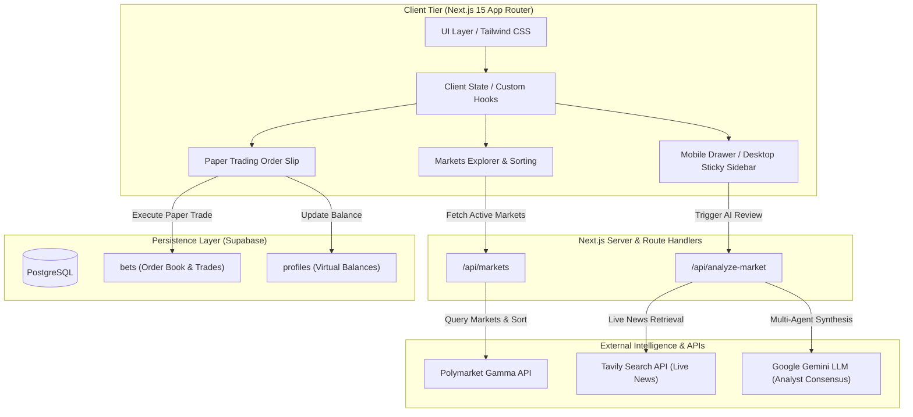
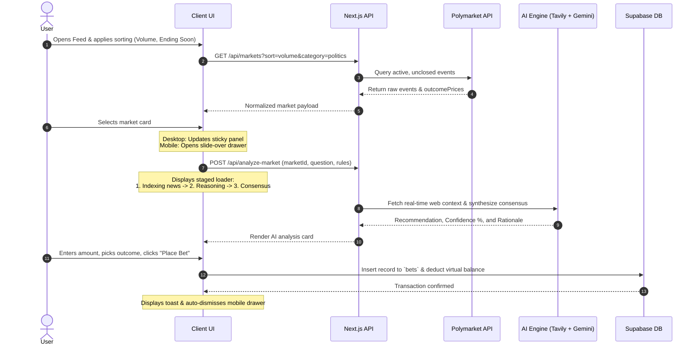

# 🌐 Polymarket AI Predictor & Paper Trading Terminal

> An institutional-grade, Apple-inspired prediction market terminal that bridges decentralized probability feeds with real-time multi-agent AI reasoning and risk-free paper trading execution.

---

## ⚡ Executive Summary (For Stakeholders & Product Leaders)

Prediction markets like Polymarket aggregate real-world probabilities through collective capital, yet retail participants face two structural hurdles:

1. **Information Asymmetry:** Breaking events evolve faster than single retail traders can research and price.
2. **Execution Friction:** Real capital exposure prevents users from validating strategies or building conviction before trading.

**Polymarket AI Predictor** solves this by pairing Polymarket's live Gamma market feeds with a **Multi-Agent AI Consensus Engine** and a **zero-risk Paper Trading Engine**. Users can explore high-volume global markets, monitor simulated multi-step AI due diligence, identify probability edges, and simulate positions with virtual USDC—all inside an interface built around Apple-grade design standards.

---

## 🏛️ System Architecture



---

## 🔄 End-to-End Decision Flow



---

## 🚀 Key Features

### 1. Market Feed & Dynamic Normalization
- **Full Polymarket Ingestion:** Direct integration with Polymarket’s Gamma API with server-side normalization for variable payloads.
- **Dynamic Outcome Parsing:** Automatically handles binary (YES/NO), categorical (Candidate A/Candidate B), and metric-driven markets (Over/Under) directly from outcomes arrays.
- **Multi-Vector Sorting:** Instant sorting across Highest Volume, Ending Soon (filtering strictly non-expired timestamps), and Newest Markets.
- **Category Overflow Navigation:** Horizontal carousel navigation with smooth gradient masks and responsive directional triggers.

### 2. Multi-Agent AI Consensus
- **Staged Pipeline Animation:** Transparent, multi-step visual progress tracking (News indexing via search -> Analyst agent verification -> Quantitative consensus calculation) that eliminates perceived latency.
- **Synthesized Rationales:** Context-aware, 2-to-3 sentence executive summaries detailing the fundamental driver behind current odds.
- **Direct Slip Injection:** One-click transfer of AI recommendations directly into the execution slip.

### 3. High-Fidelity Paper Trading Slip
- **Real-Time Math:** Automatic calculation of acquired shares, execution price, and potential payout based on contract pricing tokens (`clobTokenIds`).
- **One-Tap Quick Sizing:** Preset position allocations (+$10, +$50, +$100, Max).
- **External Deep Linking:** Instant access to the underlying Polymarket contract via customized "Trade on Polymarket ↗" routing.
- **State Persistence:** Persistent virtual balance ($1,000.00 USDC starter) and order history backed by Supabase.

### 4. Apple-Grade Responsive Interface
- **Refined Light Aesthetic:** Light ceramic palette (`#ffffff`, `#f5f5f7`), 1px structural borders (`#e5e5ea`), and subtle drop shadows.
- **Translucent Semantic Indicators:** High-contrast text highlights with alpha-channel background containers for odds.
- **Adaptive Viewport Architecture:** Two-column sticky split on desktop (`lg:`) shifting seamlessly to an accessible full slide-over drawer on mobile viewports with body-scroll locking safeguards.

---

## 🛠️ Tech Stack & Engineering Decisions

| Layer | Technology | Decision Rationale |
| :--- | :--- | :--- |
| **Framework** | Next.js 15 (App Router) | Hybrid SSR/CSR architecture for optimized initial paint and edge API route security. |
| **Language** | TypeScript 5 (Strict) | Strict schema guarantees across messy third-party contract payloads and database schemas. |
| **Styling** | Tailwind CSS | Atomic token control matching precise Apple Human Interface Guidelines and alpha colors. |
| **Database** | Supabase (PostgreSQL) | Low-latency relational storage with Row-Level Security (RLS) for user portfolios and bet logs. |
| **AI Layer** | Google Gemini + Tavily | High-speed semantic synthesis paired with real-time news indexing for non-hallucinatory consensus. |
| **Tooling** | Google Stitch & Antigravity | Rapid design system prototyping exported into pixel-perfect implementation code. |

---

## 📊 Data Schema (Supabase)

```sql
-- Bets Table: Tracks paper trading execution
create table public.bets (
  id uuid primary key default gen_random_uuid(),
  user_id uuid references auth.users(id) on delete cascade,
  market_id text not null,
  market_question text not null,
  outcome text not null,               -- Dynamic label (e.g., "YES", "Over 2.5", "Trump")
  amount numeric not null,              -- Amount staked in USDC
  price numeric not null,               -- Price per share at time of execution
  shares numeric not null,              -- Total contracts acquired
  potential_payout numeric not null,
  status text default 'open',           -- 'open' | 'resolved_win' | 'resolved_loss'
  ai_assisted boolean default false,
  created_at timestamp with time zone default timezone('utc'::text, now()) not null
);

-- Profiles Table: Manages virtual balances
create table public.profiles (
  id uuid primary key references auth.users(id) on delete cascade,
  virtual_balance numeric default 1000.00 not null,
  updated_at timestamp with time zone default timezone('utc'::text, now()) not null
);
```

---

## 💻 Local Development Setup

### 1. Prerequisites
- Node.js 18.17+ or Node.js 20+
- A Supabase Project (or local Supabase CLI)
- API Keys: Polymarket (Public Gamma), Tavily API, and Google Gemini API

### 2. Installation
```bash
# Clone the repository
git clone https://github.com/your-username/polymarket-ai-predictor.git
cd polymarket-ai-predictor

# Install dependencies
npm install
```

### 3. Environment Variables
Create a `.env.local` file in the root directory:
```env
# Supabase Configuration
NEXT_PUBLIC_SUPABASE_URL=https://your-project.supabase.co
NEXT_PUBLIC_SUPABASE_ANON_KEY=your-anon-key

# AI Intelligence
GEMINI_API_KEY=your-gemini-api-key
TAVILY_API_KEY=your-tavily-api-key

# Polymarket Gamma API Endpoint
NEXT_PUBLIC_POLYMARKET_API_URL=https://gamma-api.polymarket.com
```

### 4. Run Development Server
```bash
npm run dev
```

Open [http://localhost:3000](http://localhost:3000/) to view the terminal.

---

## 🔮 Roadmap

- [ ] **+EV (Expected Value) Discrepancy Engine:** Algorithmic calculation of variance between consensus odds and market pricing to highlight actionable arbitrage.
- [ ] **Dialectic Bull vs. Bear Debate:** Split agent architecture highlighting opposing arguments with explicit source citations.
- [ ] **Brier Score Historical Tracking:** Empirical calibration analytics tracking AI accuracy against realized market outcomes.
